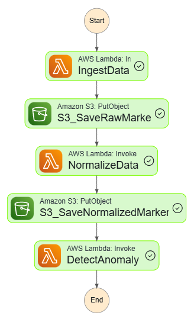

# eCommerce Metrics Intelligence (EMI)
eCommerce Metrics Intelligence (EMI) is a serverless AWS pipeline that simulates real-world eCommerce data ingestion and performs automated anomaly detection on revenue and performance metrics.

The project uses synthetic API-generated commerce data to design, test, and validate a production-style data pipeline, from ingestion and normalization to statistical anomaly detection and alerting.

## What problem does EMI solve?
In eCommerce platforms, revenue and performance metrics can sometimes exhibit unexpected spikes, drops, or irregular patterns.

These anomalies may indicate:
- Tracking issues
- Pricing errors
- Fraud or abnormal activity
- Campaign misconfiguration
- Data pipeline corruption
- Sudden market shifts

However, reacting to every fluctuation is not practical.
EMI provides a structured way to:
- Continuously ingest commerce data
- Normalize and clean raw inputs from different platforms
- Apply statistical anomaly detection (rolling Mahalanobis distance)
- Generate alerts only when behavior significantly deviates from expected patterns
- Monitor the entire pipeline with cloud-native observability

The goal is to detect meaningful anomalies while reducing noise and false positives.

## Architecture (Flow)
EMI is an event-driven, serverless pipeline on AWS:



## Components
1- Raw Source (Hosted JSON/API): Synthetic eCommerce metrics exposed via URL.

2- Ingest Lambda: Fetches raw JSON from the source URL and writes it into S3 raw/.

3- S3 (raw/): Durable storage for replay/debugging and pipeline decoupling.

4- Normalize Lambda: Cleans and maps raw data into a canonical schema, then writes to normalized/.

5- Detect Lambda (Mahalanobis): Runs rolling Mahalanobis distance anomaly detection and produces processed/ output.

6- SNS + CloudWatch: Sends anomaly alerts and publishes metrics like AnomalyCount for dashboards/alarms.

## Normalize Module Structure
```
index.py                      # AWS Lambda entrypoint (event parsing + call orchestrator)
normalize/coerce.py           # Type coercion utilities (string→number, currency cleanup, null→0, clamp negatives)
normalize/validate.py         # Payload & record validation (strict schema, required fields, date format checks)
normalize/transform.py        # Transform raw rows into strict normalized records
normalize/dedupe.py           # Duplicate resolution by date (keep highest revenue, count removed rows)
normalize/s3_io.py            # S3 read/write helpers (get_object, head_object for idempotency, put_object)
normalize/output.py           # Deterministic output key builder + NDJSON serializer
normalize/metrics.py          # CloudWatch EMF metrics emitter (files processed, rows written, drops, dups, duration)
normalize/orchestrator.py     # Main pipeline coordinator (read → validate → transform → dedupe → write → metrics)
normalize/normalize_core.py   # Backward-compatibility wrapper for legacy handler usage
```
## EMI Production –Adding More Controls Steps
<strong>1- Idempotency (Duplicate-Safe Processing)</strong> <br>
Amazon S3 and Lambda can deliver duplicate events due to retries or internal failures.
This means the same raw file might trigger Normalize more than once.<br>
Ensure that each raw file is processed exactly once, even if the event is delivered multiple times.


<strong>2- Failure Handling (No Silent Data Loss)</strong> <br>
Lambda async invocations retry automatically on failure.
After retries are exhausted, the event can be lost unless we configure a failure destination.<br>
Capture failed events (via Lambda Destinations or DLQ) so they can be investigated or reprocessed safely.

<strong>3- Observability & Metrics (Operational Visibility)</strong> <br>
Logs are useful for debugging, but they are not operational monitoring.
- Records received
- Records written
- Dropped/invalid rows
- Duplicates removed
- Processing time


## Detection Method
<strong>Mahalanobis Distance</strong>

EMI currently uses rolling Mahalanobis distance for multivariate anomaly detection.
Mahalanobis distance measures how far a data point deviates from the expected distribution while accounting for the correlation between features.

Unlike simple univariate methods (e.g., Z-score), Mahalanobis considers multiple metrics simultaneously, such as:
- Orders
- Average Order Value
- Revenue

This makes it more suitable for eCommerce monitoring, where anomalies often appear as unusual combinations of metrics rather than isolated spikes in a single value.

Advantages:

- Lightweight and computationally efficient
- No complex training phase required
- Works well for structured tabular data
- Easy to interpret and debug
- Suitable for serverless execution

## Future Upgrade: Mapping + Isolation Forest

<strong>1- Mapping (multi-platform support)</strong><br>
Reserved for future multi-platform field mapping support (Shopify / WooCommerce / PrestaShop), enabling raw field aliases to map into the strict EMI schema without changing core logic.

<strong>2- Isolation Forest (advanced anomaly detection)</strong><br>
While Mahalanobis works well for linearly correlated features under near-Gaussian assumptions, it can struggle with complex, non-linear patterns common in real eCommerce behavior.

To support more robust detection, EMI is designed to upgrade to Isolation Forest, which:
- Detects anomalies without distribution assumptions
- Captures non-linear relationships between features
- Scales better to higher-dimensional feature sets
- Is more resilient to irregular behavioral shifts and mixed data conditions

This upgrade can improve detection performance in real-world eCommerce environments where patterns are not strictly Gaussian.